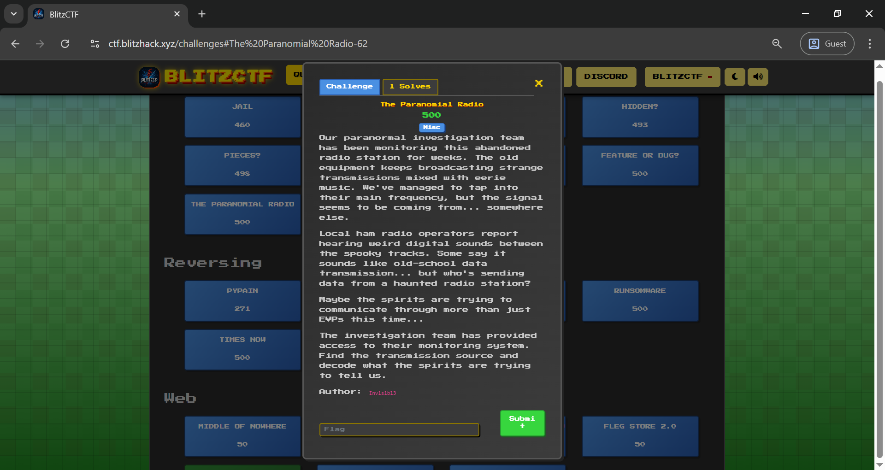

<p align="center">
  
</p>

<h1 align="center">🎮 Pixelated/Retro CTFd Theme</h1>

<p align="center">
  <strong>A retro, pixel-art inspired theme for CTFd — clean, quirky, and challenge-focused</strong>
</p>

<p align="center">
  
  
  
  
  
  
  

</p>


---

## 🧩 About

This repository contains a **custom pixelated/retro-style theme** for [CTFd](https://ctfd.io), designed to give your CTF platform a nostalgic old-school feel while preserving all modern functionality.

Features:
- Custom-styled challenge cards
- Retro fonts and UI
- Redesigned scoreboard, team pages, and settings
- Option to switch between dark and light mode.
- Toggle click sound.
- Optimized for both desktop and mobile
- Unique pixelated mouse pointer.

> 🔗 **Live Demo (Static Preview)**: [https://2025.blitzhack.xyz](https://2025.blitzhack.xyz)  
> 📌 *Note: This is a static site preview — backend features such as login, flag submission, and scoring are disabled. Static code available at [BlitzCTF-2025-Archive](https://github.com/1nv1sibl3/BlitzCTF-2025/).*

---

## 📸 Screenshots

| Home | Login | Register |
|------|-------|----------|
|  |  |  |

| Challenge Card | Scoreboard | Team Stats |
|----------------|------------|------------|
|  |  |  |

| Settings | Rules | Notifications |
|---------|--------|---------------|
|  |  |  |

---

## 🚀 Installation

To use this theme in your CTFd instance:

1. Clone this repository and move the `blitzctf` folder to the CTFd `themes/` directory:

   ```bash
   git clone https://github.com/1nv1sibl3/CTFd-Custom-Theme.git
   mv /path/to/blitzctf /path/to/CTFd/themes
   ```

2. Rename the folder `blitzctf` if needed (e.g., `pixelated`).

3. In the CTFd admin panel:

   * Go to **Admin Panel → Config → Theme Name**
   * Set the theme to `pixelated` (or the folder name you used)

4. Restart the CTFd server:

   ```bash
   docker restart ctfd
   ```
   Or click `Update` button located below the theme change dropdown.


> 💡 Tip: Test the theme on a local CTFd dev instance before using it in production.

---

## 🤝 Contributing

We welcome contributions and improvements since this theme was developed within very short span of time! Here's how you can help:

* ✏️ Suggest or design additional retro UI elements
* 🧪 Improve responsiveness or accessibility
* 🐛 Report/fix layout or browser compatibility bugs

To contribute:

1. Fork the repository
2. Create a new branch (`git checkout -b feature-name`)
3. Commit your changes (`git commit -m "Add cool feature"`)
4. Push and open a pull request

---

## 👤 Credits

Built with ❤️ by:

* [Inv1s1bl3](https://github.com/1nv1sibl3/)
* [5h1kh4r](https://github.com/shikharSomething/)

---

## 📜 License

This project is licensed under the [MIT License](LICENSE).

---

<p align="center">
  ✨ Retro never goes out of style — use this theme to power your next nostalgic CTF! ✨
</p>


---
